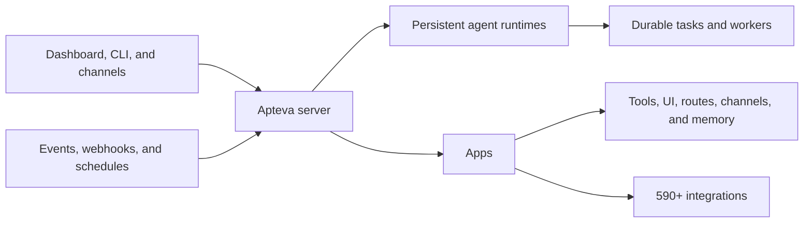

<p align="center">
  <a href="https://apteva.ai">
    
  </a>
</p>

<h1 align="center">Apteva</h1>

<p align="center">
  <strong>AI agents, batteries included.</strong>
</p>

<p align="center">
  The open-source, self-hosted platform for agents that keep working after the chat ends.
</p>

<p align="center">
  Give agents goals. They remember context, react to events, schedule and resume work,<br />
  delegate to workers, and operate through apps and 590+ integrations.
</p>

<p align="center">
  <a href="https://apteva.ai">Website</a> ·
  <a href="https://docs.apteva.ai/get-started">Docs</a> ·
  <a href="https://apteva.ai/apps">Apps</a> ·
  <a href="https://apteva.ai/cloud">Cloud</a> ·
  <a href="https://discord.gg/apteva">Discord</a>
</p>

<p align="center">
  <a href="https://github.com/apteva/apteva/releases/latest"></a>
  <a href="https://www.npmjs.com/package/apteva"></a>
  <a href="https://github.com/apteva/apteva/actions/workflows/release.yml"></a>
  <a href="https://github.com/apteva/apteva"></a>
</p>

---

## Start in 30 seconds

```bash
npx apteva
```

On macOS or Linux with Node.js 18+. The installer downloads the current native release. Connect a model provider, create an agent, and Apteva opens the local dashboard.

Apteva runs locally by default. Your agents, credentials, memory, and operational data stay under your control.

## Agents are easy to demo. Hard to operate.

A prototype agent can call a tool. A production agent also needs durable state, memory, permissions, events, schedules, workers, retries, dashboards, integrations, and deployment.

Apteva packages that operating layer into one workspace. Instead of rebuilding the same infrastructure for every agent, you get a complete system for ongoing operations.

| | What Apteva provides |
|---|---|
| **Keeps working** | Agents react to events, follow up on unresolved work, and continue across hours or days. |
| **Durable by default** | Tasks, schedules, history, memory, and progress survive restarts and closed chats. |
| **A complete operating layer** | Runtime, server, dashboard, channels, apps, integrations, files, logs, and deployment work together. |
| **Apps, not just tool wrappers** | One app can add tools, UI panels, routes, workers, channels, memory, and domain workflows. |
| **Multi-agent operations** | Agents delegate bounded work to dedicated workers while retaining durable ownership and visibility. |
| **Control where it runs** | Use Apteva locally, self-host it on a VPS or Docker, or run it on Apteva Cloud. |

## What agents can operate

| Operation | Examples |
|---|---|
| **Customer support** | Triage tickets, search knowledge bases, draft replies, and escalate when human judgment is needed. |
| **Sales and CRM** | Enrich leads, schedule follow-ups, update pipelines, and surface deals that need attention. |
| **Content and growth** | Research, create assets, publish across channels, and monitor performance. |
| **Engineering and DevOps** | Watch deployments, investigate alerts, run tests, prepare patches, and coordinate incidents. |
| **Back-office work** | Process invoices, reconcile data, manage inventory, and coordinate vendors. |
| **Devices and edge systems** | Run the Go-based agent core close to browsers, machines, robots, and local infrastructure. |

## Apps turn agents into operators

Apteva apps extend the platform with any combination of:

- MCP tools and integrations
- Dashboard and chat UI
- HTTP routes and webhooks
- Background workers and scheduled jobs
- Channels, memory, and shared operational data

The current catalog contains **590+ integrations**, including GitHub, Slack, Stripe, Shopify, Airtable, Twilio, HubSpot, Google Workspace, cloud providers, databases, media tools, and model APIs.

[Browse apps](https://apteva.ai/apps) · [Explore the integrations repository](https://github.com/apteva/integrations) · [Build with the App SDK](https://github.com/apteva/app-sdk)

## How it works



The CLI installs and starts the platform. The server manages authentication, projects, agent runtimes, apps, connections, events, and the dashboard. Each agent core owns its thinking loop, threads, tools, memory, and persistent history.

## Run it your way

### Local

```bash
npx apteva
```

### Docker

```bash
docker run -d \
  --name apteva \
  -p 5280:5280 \
  -v apteva-data:/data \
  ghcr.io/apteva/apteva:latest
```

Then open [http://localhost:5280](http://localhost:5280). Pin a numbered image tag instead of `latest` for production deployments.

### Cloud

[Apteva Cloud](https://apteva.ai/cloud) runs the same platform without managing the server yourself.

## Bring your models

Use hosted or local models, choose different providers per project, and switch models without rebuilding your agents. Apteva supports OpenAI, Anthropic, Google, Fireworks, Ollama, NVIDIA, Venice, xAI, and other compatible providers.

## Repositories

| Repository | Role |
|---|---|
| [`apteva/apteva`](https://github.com/apteva/apteva) | CLI, installer, local lifecycle, and releases |
| [`apteva/core`](https://github.com/apteva/core) | Persistent agent runtime and thinking loop |
| [`apteva/server`](https://github.com/apteva/server) | Management API, agent orchestration, apps, and embedded dashboard |
| [`apteva/dashboard`](https://github.com/apteva/dashboard) | React administration and operations UI |
| [`apteva/integrations`](https://github.com/apteva/integrations) | Integration catalog, OAuth, webhooks, and MCP generation |
| [`apteva/apps`](https://github.com/apteva/apps) | First-party operational apps |
| [`apteva/app-sdk`](https://github.com/apteva/app-sdk) | Go SDK for building Apteva apps |
| [`apteva/computer`](https://github.com/apteva/computer) | Browser and computer-use backends |

## Community

Read the [documentation](https://docs.apteva.ai/get-started), join the [Discord community](https://discord.gg/apteva), or open an [issue](https://github.com/apteva/apteva/issues) for bugs and feature requests.

If Apteva helps you build agents that do real work, [star the repository](https://github.com/apteva/apteva) so more builders can find it.

---

<p align="center">
  <strong>Build agents that operate, not just respond.</strong><br />
  <a href="https://apteva.ai">apteva.ai</a>
</p>
